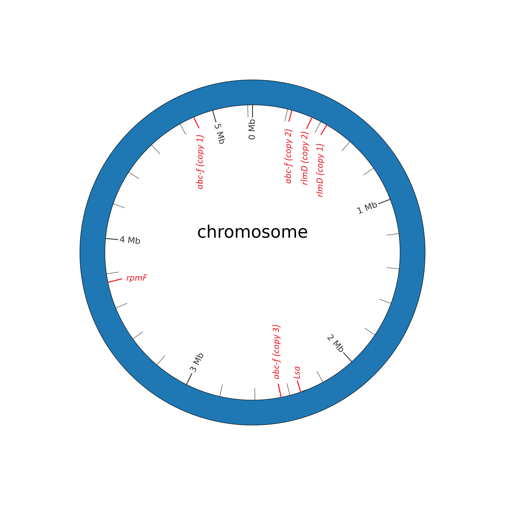

### Appendix LETTER: Location of lincosamides AMR associated genes within Bacillus anthracis str. Ames Ancestor Chromosome

**Biothreat pathogen:** Bacillus anthracis str. Ames Ancestor NC_007530.2  
**Antibiotic Class:** Lincosamides  
**Antibiotics:** Clindamycin  
**AMR genes description:**  
- rlmD (copy 1): 23S rRNA (uracil(1939)-C(5))-methyltransferase RlmD
- rlmD (copy 2): 23S rRNA (uracil(1939)-C(5))-methyltransferase RlmD
- rpmF: 50S ribosomal protein L32
- abc-f: ABC-F type ribosomal protection protein  
  
**Gene location:**                      
- rlmD (copy 1): 445,947 - 447,326
- rlmD (copy 2): 342,478 – 343,854
- rpmF: 3,744,933 -3,745,106
- abc-f (copy 1): 2,421,248-2,422,875

| Gene | AMR description | Manuscript |
| :------ | :------ | :------ |
|rlmD (copy 1) | The 23S methyltransferase rlmD has been associated AMR mutations. | https://www.mdpi.com/2076-0817/9/7/588 |
| rlmD (copy 2) | The 23S methyltransferase rlmD has been associated AMR mutations. | https://www.mdpi.com/2076-0817/9/7/588 |
| rpmF | | https://www.sciencedirect.com/science/article/pii/S1438422119301547 |
| abc-f (copy 1) | ABC-F type ribosomal protection protein are widely distributed throughout Gram-positive bacteria and bind the ribosome to alleviate translational inhibition from antibiotics that target the large ribosomal subunit. | https://www.nature.com/articles/s41467-021-23753-1 |

