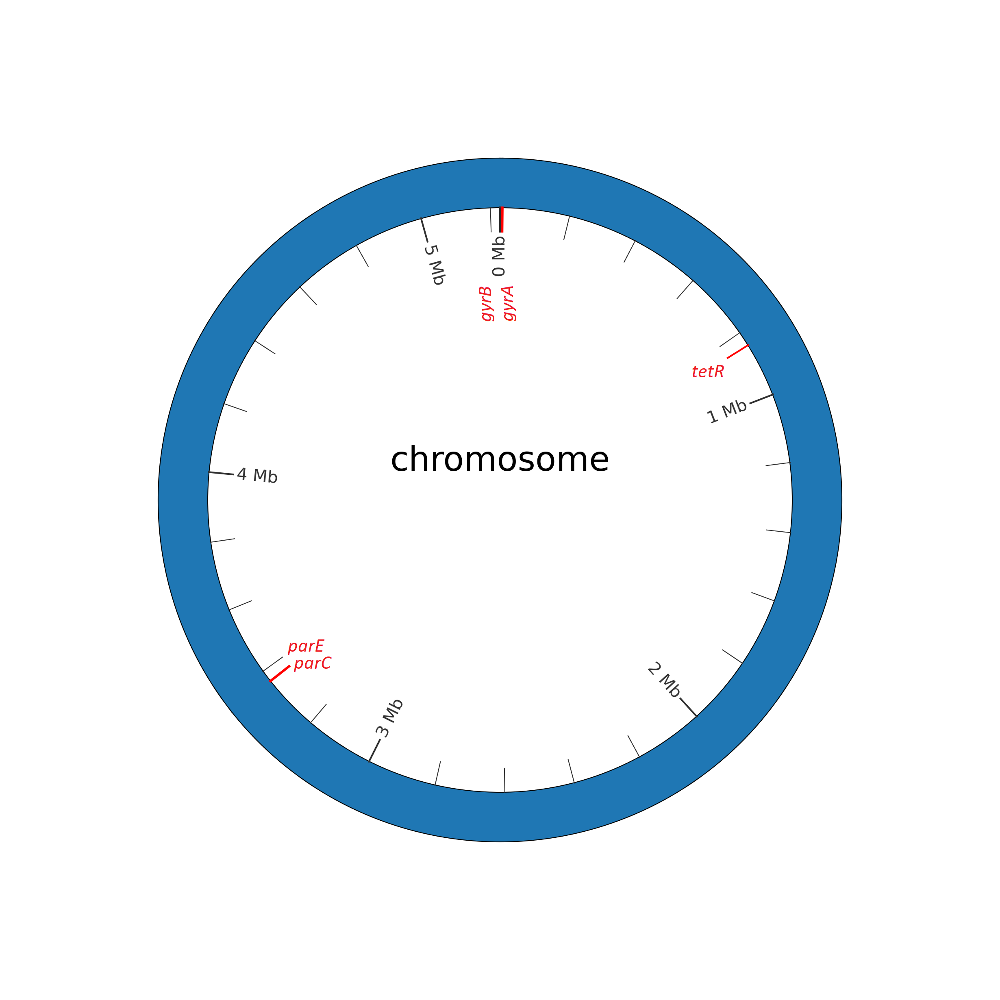

### Appendix LETTER: Location of quinolones AMR associated genes within Bacillus anthracis str. Ames Ancestor Chromosome

**Biothreat pathogen:** Bacillus anthracis str. Ames Ancestor NC_007530.2  
**Antibiotic Class:** Quinolones  
**Antibiotics:** Ciprofloxacin, ofloxacin, levofloxacin, and moxifloxacin  
**AMR genes description:**  
- gyrA: DNA gyrase subunit A
- gyrB: DNA topoisomerase (ATP-hydrolyzing) subunit B
- parC: DNA topoisomerase IV subunit A
- parE: DNA topoisomerase IV subunit B
- tetR: TetR family transcriptional regulator
  
**Gene location:**                      
- gyrA: 6,595 -9,066
- gyrB: 4,584 - 6,506
- parC: 3,362,705 - 3,365,128
- parE: 3,365,130 - 3,367,094
- GBAA_RS04545 or tetR: 842,403 – 842,981

| Gene | AMR description | Manuscript |
| :------ | :------ | :------ |
| gyrA | Mutations in the gyrA gene have been associated with resistance to certain classes of antibiotics, particularly fluoroquinolones. | https://pubmed.ncbi.nlm.nih.gov/12821500/ |
| gyrB | Mutations in the gyrB gene can also lead to resistance against fluoroquinolone antibiotics. However, compared to the gyrA gene, mutations in gyrB are less commonly associated with antibiotic resistance. | https://pubmed.ncbi.nlm.nih.gov/15190035/ |
| parC | Mutations in the parC gene can lead to resistance against fluoroquinolone antibiotics, similar to the gyrA and gyrB genes.Mutations in the parC gene can lead to resistance against fluoroquinolone antibiotics, similar to the gyrA and gyrB genes. | https://pubmed.ncbi.nlm.nih.gov/32273351/ |
| parE | Similar to the gyrA, gyrB, and parC genes, mutations in the parE gene can also contribute to antibiotic resistance, particularly against fluoroquinolone antibiotics. | https://www.osti.gov/servlets/purl/1117920 |
| GBAA_RS04545 or tetR | TetR-type transcriptional regulators have been described as a novel "mutation hot spot" that leads to the increased expression of multidrug efflux systems for CIP resistance. | https://pubmed.ncbi.nlm.nih.gov/20385868/ https://pubmed.ncbi.nlm.nih.gov/32273351/ | 

